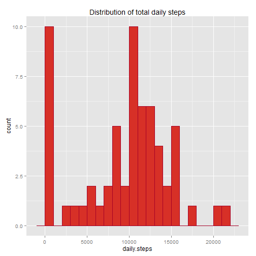

## Setting up the R working environment


```r
library(lubridate)
library(dplyr)
library(ggplot2)
library(RColorBrewer)
library(gridExtra)
library(scales)

# Create a consistent palette for displays

palette <- brewer.pal(11,"RdYlGn")

message(getwd())
```

```
## C:/Users/charl/Documents/GitHub/RepData_PeerAssessment1
```

## Loading and preprocessing the data

A zip file archive of the raw data was downloaded from the course web site [course web site](https://d396qusza40orc.cloudfront.net/repdata%2Fdata%2Factivity.zip) and the raw data file *activity.csv* was extracted. (Note: the *activity.csv* data file was also available in the course GitHub respository, but I decided to make no assumptions about the working environment.) The time of the download was saved in download-time.txt. This report is based on data downloaded on **2016-01-10 09:07:43**

The data file was read into an R data frame with a standard read.csv() call, converting "NA" strings to R NA values. Two further bits of processing were done:

* Date strings were converted to POSIXct format.
* A column (*weekend*) was added to identify weekends and weekdays, to be used in later analysis.


```r
# Download and unzip the raw data (activity.csv), and record when the download was taken

data.url <- "https://d396qusza40orc.cloudfront.net/repdata%2Fdata%2Factivity.zip"
local.zip.file <- "data.zip"
local.data.file <- "activity.csv"
local.data.download.time.file <- "download-time.txt"

if (!file.exists(local.data.file)){
  download.file(data.url, local.zip.file)
  if (file.exists(local.zip.file)){
    message("data archive zip downloaded")
  }
  
  unzip(local.zip.file, overwrite = TRUE)
  if (file.exists(local.data.file)){
    message("activity.csv file extracted")
  }
  
  local.data.file.download.time <- now()

  outfile <- file(local.data.download.time.file, "wt")
  writeLines(as.character(local.data.file.download.time), outfile)
  close(outfile)
}

# Display when the download was taken

if (file.exists(local.data.download.time.file)){
  infile <- file(local.data.download.time.file, "rt")
  saved.data.read.time <- readLines(infile, 1)
  close(infile)
  
  message(paste("activity.csv file downloaded at", saved.data.read.time))
} else {
  warning("activity.csv file exists, but no download time has been recorded")
}
```

```
## activity.csv file downloaded at 2016-01-10 09:07:43
```

```r
# Read the data file (activity.csv)

step.data <- read.csv(local.data.file, header = TRUE, na.strings = "NA", stringsAsFactors = FALSE)

# Convert date strings to native POSIXct format

step.data$date <- ymd(step.data$date)

# Add a factor column to segregate weekends and weekdays

step.data$weekend[wday(step.data$date) >= 2 & wday(step.data$date) <= 6] <- "weekday"
step.data$weekend[!(wday(step.data$date) >= 2 & wday(step.data$date) <= 6)] <- "weekend"
step.data$weekend <- as.factor(step.data$weekend)
```


## What is mean total number of steps taken per day?


```r
# Compute the total number of steps per day

daily.total.steps <- step.data %>% group_by(date) %>% summarize(daily.steps = sum(steps,na.rm = TRUE))

# Make a histogram graph of the total number of steps recorded per day

g.daily.steps <- ggplot(daily.total.steps, aes(daily.steps)) + geom_histogram(binwidth=1000, colour=palette[1], fill=palette[2])
g.daily.steps <- g.daily.steps + ggtitle("Distribution of total daily steps")

print(g.daily.steps)
```

 


```r
# Display mean and median steps per day values

message(paste("mean steps per day =", round(mean(daily.total.steps$daily.steps),0)))
```

```
## mean steps per day = 9354
```

```r
message(paste("median steps per day =", median(daily.total.steps$daily.steps)))
```

```
## median steps per day = 10395
```
Note that there are 10 days with **no** recorded step activity at all. The spike at daily.steps == 0 drags the mean down relative to the median.

## What is the average daily activity pattern?


```r
# Compute average number of steps per 5-minute interval across all days

per.interval.average.steps <- step.data %>% group_by(interval) %>% summarize(steps = mean(steps, na.rm=TRUE))

# Use a shorter name for per.interval.average.steps, just to save on typing

xx <- per.interval.average.steps

# Convert the interval identifiers into a real time sequence for plotting

xx$interval.times <- ymd("2000-01-01") + hm(sprintf("%d %d",xx$interval %/% 100, xx$interval %% 100))

g.time.sequence <- ggplot(xx, aes(interval.times, steps)) + geom_line() + scale_x_datetime(labels=date_format("%H"))
g.time.sequence <- g.time.sequence + ggtitle("Average number of steps per 5-minute interval")
g.time.sequence <- g.time.sequence + xlab("time of day")

print(g.time.sequence)
```

 

As we would expect, average step counts are almost zero between midnight and 5:00am, rising to a high peak during the morning (perhaps a workout?), then trailing off in the evening.


```r
busiest.interval <- as.numeric(xx[max(xx$steps) == xx$steps,1])
busiest.interval.hour <- busiest.interval %/% 100
busiest.interval.minute <- busiest.interval %% 100
busiest.interval.display <- sprintf("%d (%d:%d)", busiest.interval, busiest.interval.hour, busiest.interval.minute)

message(paste("busiest interval =", busiest.interval.display))
```

```
## busiest interval = 835 (8:35)
```

```r
message(paste("ave steps in busiest interval =", round(max(xx$steps),0)))
```

```
## ave steps in busiest interval = 206
```

## Imputing missing values


```r
# Analyse NAs in the data

message(paste("missing step values = ", sum(is.na(step.data))))
```

```
## missing step values =  2304
```

```r
message(paste("rows with missing data = ",nrow(step.data) - sum(complete.cases(step.data))))
```

```
## rows with missing data =  2304
```

```r
# Display days with NA's

step.data %>% filter(is.na(steps)) %>% group_by(date) %>% summarize(nas.per.day = n())
```

```
## Source: local data frame [8 x 2]
## 
##         date nas.per.day
##       (time)       (int)
## 1 2012-10-01         288
## 2 2012-10-08         288
## 3 2012-11-01         288
## 4 2012-11-04         288
## 5 2012-11-09         288
## 6 2012-11-10         288
## 7 2012-11-14         288
## 8 2012-11-30         288
```

Notes:

* There are 2304 NAs in the data-set
* All the NAs are in the step counts
* All the NAs are associated with entire days of missing data. In other words, of the 10 days for which we originally computed total.steps == 0, for 8 of them we have no data at all. 

As a first pass at imputing the missing data, each missing steps data value was replaced with the mean value for that period computed previously across all days (*per.interval.average.steps*, aliased as *xx*)


```r
# Impute missing data by replacing steps == NA with the mean value for that interval
# as calculated earlier.

cleaned.step.data <- step.data
for (x in seq_along(cleaned.step.data$steps)){
  if (is.na(cleaned.step.data$steps[x])){
    replacement.value = as.numeric(xx[xx$interval == cleaned.step.data$interval[x],2])
    cleaned.step.data$steps[x] <- round(replacement.value,0)
  }
}
```


```r
# Repeat previous steps-per-day plot with the imputed data set

y <- cleaned.step.data %>% group_by(date) %>% summarize(daily.steps = sum(steps,na.rm = TRUE))

g.daily.steps.cleaned <- ggplot(y, aes(daily.steps)) + geom_histogram(binwidth=1000, colour=palette[1], fill=palette[2])
g.daily.steps.cleaned <- g.daily.steps.cleaned + ggtitle("Distribution of total daily steps (cleaned data)")

# Repeat previous steps-per-day plot with the imputed data set

y <- cleaned.step.data %>% group_by(date) %>% summarize(daily.steps = sum(steps,na.rm = TRUE))

g.daily.steps.cleaned <- ggplot(y, aes(daily.steps)) + geom_histogram(binwidth=1000, colour=palette[1], fill=palette[2])
g.daily.steps.cleaned <- g.daily.steps.cleaned + ggtitle("Distribution of total daily steps (cleaned data)")

print(g.daily.steps.cleaned)
```

 


```r
grid.arrange(g.daily.steps, g.daily.steps.cleaned)
```

 


```r
message(paste("mean steps per day (cleaned data) =", round(mean(y$daily.steps),0)))
```

```
## mean steps per day (cleaned data) = 10766
```

```r
message(paste("median steps per day (cleaned data) =", median(y$daily.steps)))
```

```
## median steps per day (cleaned data) = 10762
```

By imputing the missing data this way, the 8 days with no data (all NA values) are converted into 8  identically "average" days. The spike at daily.steps == 0 moves to the middle of the distribution. As expected, this doesn't change the median value, and make the mean value closer to the median. 

## Are there differences in activity patterns between weekdays and weekends?

If we go back to the original step data we see that the subject took more steps per day on weekends than weekdays.


```r
# Display difference between daily step averages for weekdays and weekends

step.data %>% group_by(date,weekend) %>% summarize(total.steps=sum(steps, na.rm=TRUE)) %>% group_by(weekend) %>% summarize(daily.average=mean(total.steps))
```

```
## Source: local data frame [2 x 2]
## 
##   weekend daily.average
##    (fctr)         (dbl)
## 1 weekday      8820.356
## 2 weekend     10855.750
```


```r
# Repeat the time-series analysis, but this time using the cleaned data, and comparing weekend and 
# weekday profiles by using a facet plot

per.interval.average.steps.cleaned <- cleaned.step.data %>% group_by(weekend, interval) %>% summarize(steps = mean(steps, na.rm=TRUE))

# Use a shorter name for per.interval.average.steps, just to save on typing

xx <- per.interval.average.steps.cleaned

# Convert the interval identifiers into a real time sequence for plotting

xx$interval.times <- ymd("2000-01-01") + hm(sprintf("%d %d",xx$interval %/% 100, xx$interval %% 100))

g.weekend.compare <- ggplot(xx, aes(interval.times, steps, color = weekend)) + geom_line() + scale_x_datetime(labels=date_format("%H"))
g.weekend.compare <- g.weekend.compare + scale_color_brewer(palette = "Set1")
g.weekend.compare <- g.weekend.compare + ggtitle("Average steps per 5-minute interval")
g.weekend.compare <- g.weekend.compare + xlab("time of day")
g.weekend.compare <- g.weekend.compare + facet_grid(weekend ~ .)

print(g.weekend.compare)
```

 

On weekdays activity starts earlier, peaks higher, and dies down earlier. Weekend activity is higher on average, and doesn't show the strong peak from 8-9am.

The observation that weekend and weekday profiles are different suggests that the impuning strategy could be improved so that missing weekend data would be replaced with averages from other weekend data, and similarly for missing weekday data.
